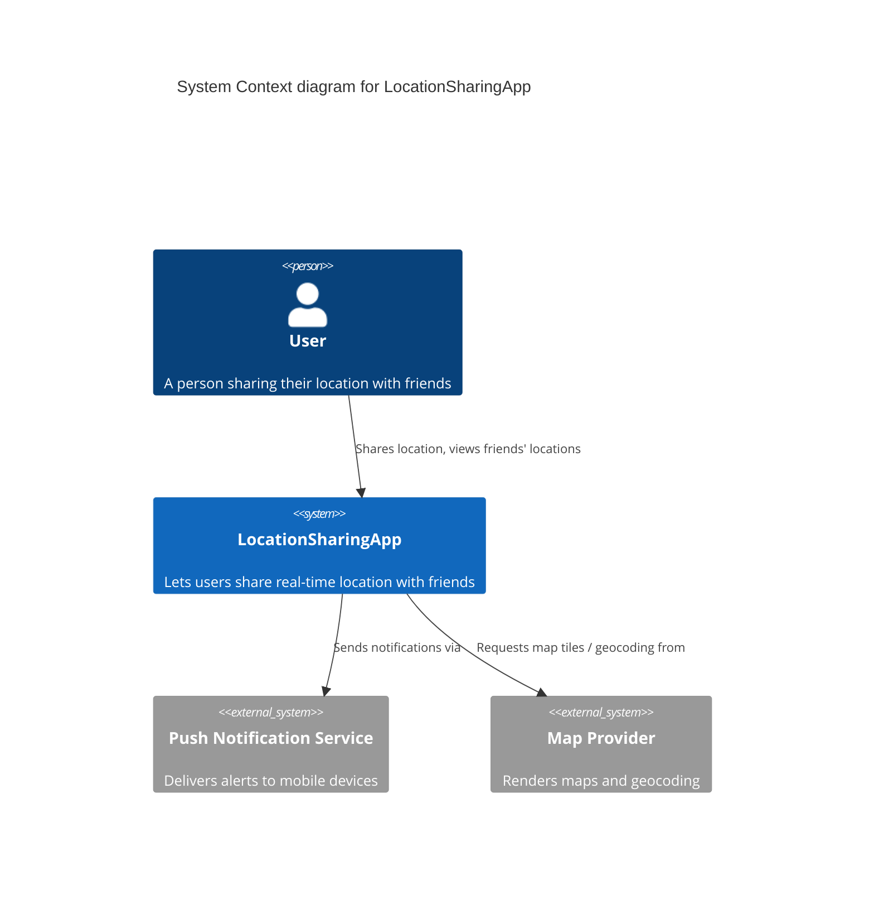

# Architecture Diagrams

Diagrams here follow the **C4 model** levels and are written as text
(Mermaid) so they are diffable and reviewable in pull requests, and never
silently drift out of sync with the code.

| Level | File | Purpose |
|-------|------|---------|
| 1. Context | `context-diagram.md` | System + external actors/systems ([§3](../context-and-scope.md)) |
| 2. Container | `container-diagram.md` | Deployable/runnable units ([§5](../building-block-view.md)) |
| 3. Component | `component-*.md` | Internals of a single container ([§5.2](../building-block-view.md#52-level-2-component-breakdown)) |
| Runtime | `sequence-*.md` | Key runtime scenarios ([§6](../runtime-view.md)) |
| Deployment | `deployment-diagram.md` | Physical/infra topology ([§7](../deployment-view.md)) |

## Example Mermaid context diagram

Use this as a starting template (`context-diagram.md`):

Add real diagrams here as the architecture is defined, and keep this README's table
up to date with the files that actually exist.
