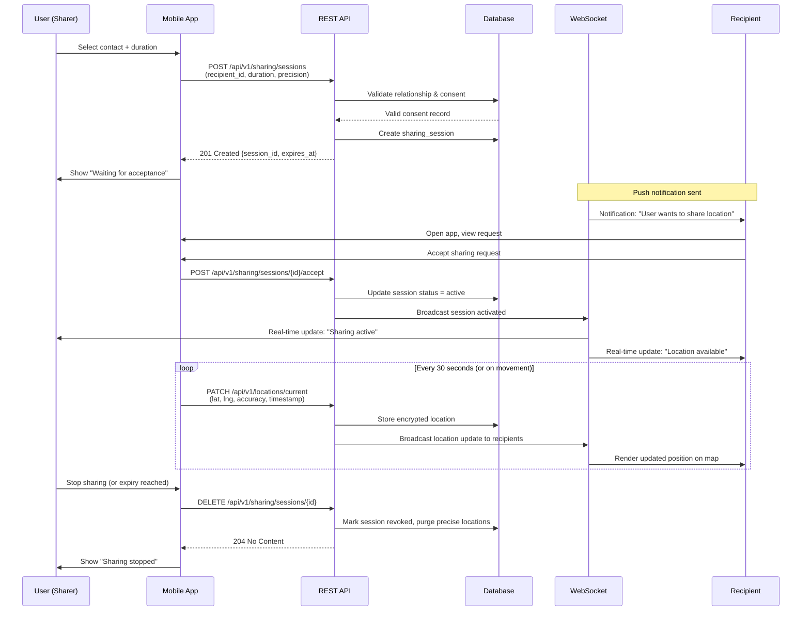
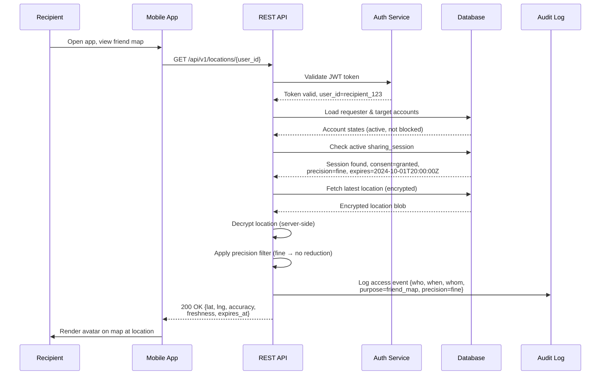
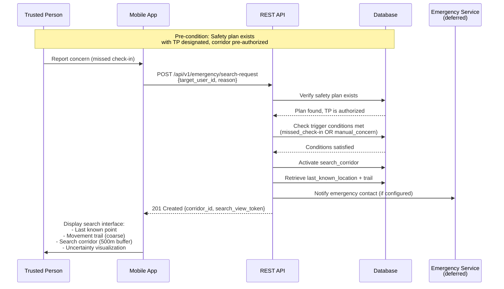
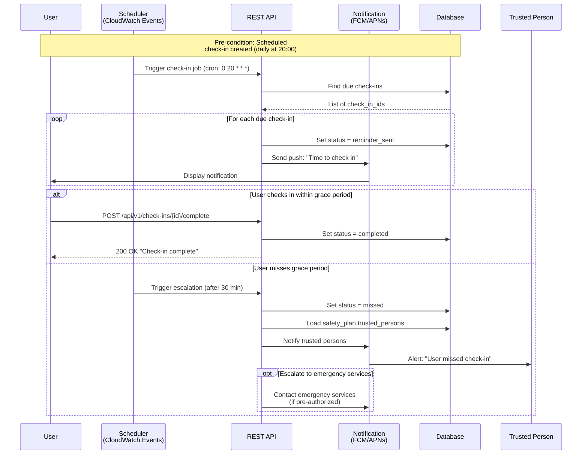

# 6. Runtime View

This section describes the dynamic behavior of the system during execution, showing how components interact to fulfill key user scenarios. Sequence diagrams illustrate the message flows between actors and system components.

## 6.1 Location Sharing (Core MVP Scenario)

See [Location Sharing Lifecycle](./location-sharing-lifecycle.md) for the full flow:
select recipient/duration → recipient accepts/declines → active sharing displayed
with freshness/accuracy/expiry → either side can stop/revoke/block/report → expiry
triggers deletion or coarse retention.

### Sequence Diagram: Location Sharing Initiation

*Figure 1: Sequence diagram showing location sharing initiation, real-time updates, and termination.*

**Key Security Checkpoints:**
1. **Consent validation** before session creation (prevents unauthorized sharing)
2. **Explicit acceptance** required before any location transmitted to recipient
3. **Encrypted storage** of all location data at rest
4. **Real-time revocation** immediately stops data flow
5. **Automatic expiry** triggers data deletion per privacy-by-design

## 6.2 Control Sequence for a Location Read

The canonical runtime scenario for authorization-sensitive reads (applies equally
to statuses, caches, friend-map layers, media, reports, and emergency context):

1. Authenticate the caller and validate the token/session.
2. Resolve the immutable caller and target IDs.
3. Check blocks and account state.
4. Check that the caller is the current authorized recipient.
5. Check directional consent, purpose, precision, expiry, and stale status.
6. Apply coarse/approximate transformation if required.
7. Redact fields not necessary for the requested view.
8. Record a privacy-preserving access event.
9. Return only the authorized representation.

### Sequence Diagram: Authorized Location Read

*Figure 2: Authorization flow for reading another user's location with all security checks.*

See [Security Architecture and Data Protection](./security-architecture-and-data-protection.md)
for the boundary-by-boundary detail (mobile, API, realtime, database, object
storage, operator).

## 6.3 Missing-Person / Search-Corridor Activation (Deferred Feature)

See [Movement Trails and Search Corridors §"Missing-person workflow"](./movement-trails-and-search-corridors.md#missing-person-workflow)
for the full sequence: safety plan creation → pre-authorization → missed check-in
or trusted-person concern → search view activation → last verified point + trail +
corridor + freshness/uncertainty displayed → automatic expiry and access logging.

### Sequence Diagram: Emergency Search Activation

*Figure 3: Emergency search corridor activation when safety plan triggers are met.*

**Privacy Safeguards:**
- Requires pre-authorized safety plan (cannot be activated ad-hoc)
- Trigger conditions must be objectively verified (missed check-in or explicit concern)
- Search view shows **coarse** locations only (privacy-preserving even in emergencies)
- All access logged with immutable audit trail
- Automatic expiry after configurable period (e.g., 24 hours)

## 6.4 Check-in Lifecycle

Manual, scheduled, and trip check-ins send reminders before any configured
escalation; states are pending, reminder_sent, grace_period, completed, cancelled,
missed. See [API Contract §"Check-Ins"](../reference/api-contract.md) for the
endpoint-level detail.

### Sequence Diagram: Scheduled Check-in Flow

*Figure 4: Scheduled check-in lifecycle with reminder and escalation paths.*

---

## Diagram Conventions

All sequence diagrams follow these conventions:
- **Participants**: Actors (users, external systems) and system components
- **Solid arrows** (`->>`): Synchronous requests/calls
- **Dashed arrows** (`-->>`): Responses/returns
- **Curved arrows** (`-)`: Asynchronous messages (notifications, events)
- **Rectangles**: Processing steps or state changes
- **Notes**: Preconditions, postconditions, or important context
- **Alt/Opt loops**: Conditional branches and optional flows

For static architecture views, see [Building Block View](./building-block-view.md) and [Deployment View](./deployment-view.md).

---
*Part of the [architecture documentation](./README.md) (arc42 §6).*
